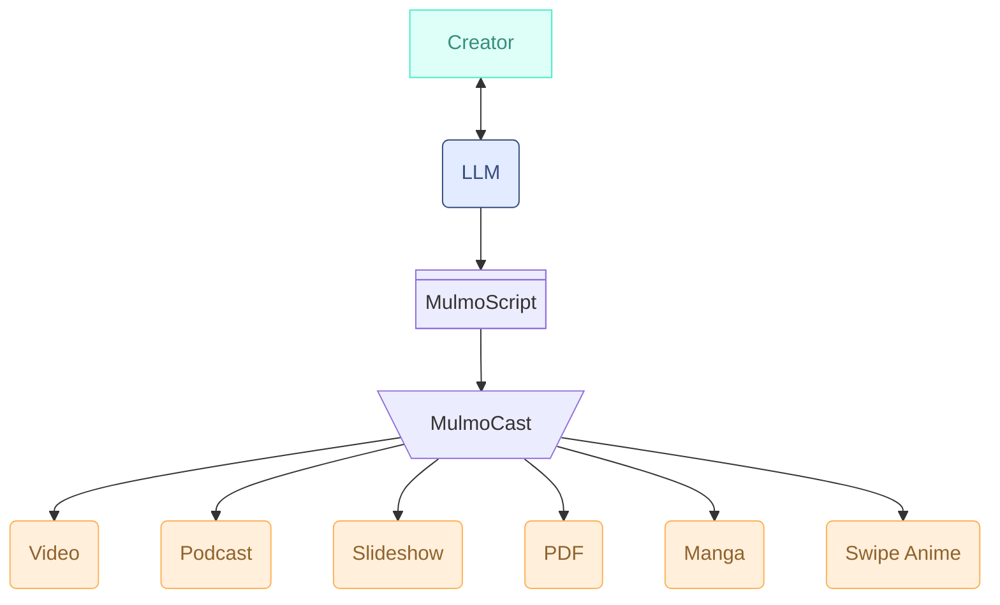

# MulmoCast: A Multi-Modal Presentation Tool for the AI-Native Era

**MulmoCast** is a next-generation presentation platform, purpose-built for a world where AI and humans collaborate to create and share ideas.

Unlike traditional tools like PowerPoint or Keynote—both designed in the pre-AI era for human creators—MulmoCast is AI-native: reimagined from the ground up to work hand-in-hand with generative AI that understands and produces natural language, images, audio, and video.

As AI takes on an increasingly central role in content creation, it needs more than raw capability—it needs an environment designed for its strengths. MulmoCast provides that environment, empowering AI to generate rich, coherent presentations across multiple formats, while keeping humans in the creative loop.

At the core of MulmoCast is **MulmoScript**, a JSON-based intermediate language that functions like a screenplay or web markup. Generated by large language models, MulmoScript defines everything from narrative structure to visuals, making it easy to produce presentations that adapt seamlessly across formats.



In today’s world, people consume information through many channels—on Zoom calls, in Slack threads, via videos on the go, or through podcasts during commutes. Presentations can no longer be confined to a single format or device. That’s why MulmoCast is built to be truly multi-modal, enabling output not only as slide decks but also as videos, podcasts, manga-style comics, and PDF documents.

Whether you're building a podcast from a research report or turning a business pitch into a narrated video, MulmoCast transforms source material into dynamic, multi-format content with the help of state-of-the-art AI like ChatGPT and Claude.

MulmoCast isn't just a tool. It’s a new foundation for communication—one where humans and AI co-create across every mode of expression.

## MulmoScript

**MulmoScript** is a simple JSON/YAML format for describing multi-modal content.  
You can define speakers, text, images, and layout — all in one script.

Here is the "Hello World" in MulmoScript.

```JSON
{
  "$mulmocast": {
    "version": "1.0"
  },
  "beats": [
    { "text": "Hello World" }
  ]
}
```

See [MulmoScript Format](#mulmoscript-format) for details on the structure.

## Installation

```bash
npm install -g mulmocast
```

You'll also need to install ffmpeg:
```bash
# For macOS with Homebrew
brew install ffmpeg

# For other platforms
# Visit https://ffmpeg.org/download.html
```

## Configuration

Create a `.env` file in your project directory with the following API keys:

### Required
```bash
OPENAI_API_KEY=your_openai_api_key
```
### Optional
```bash
DEFAULT_OPENAI_IMAGE_MODEL=gpt-image-1 # for the advanced image generation model
GOOGLE_PROJECT_ID=your_google_project_id # for Google's image generation model
NIJIVOICE_API_KEY=your_nijivoice_api_key # for Nijivoice's TTS model
BROWSERLESS_API_TOKEN=your_browserless_api_token # to access web in mulmo tool
```

## Workflow

1. Create a MulmoScript JSON file with `mulmo tool scripting`
2. Generate audio with `mulmo audio`
3. Generate images with `mulmo images` 
4. Create final video with `mulmo movie`

## Quick Start
### Step 1: Generate a MulmoScript with interactive mode
- Step 1-1: Run the script generation command
  ```bash
  mulmo tool scripting -i -t children_book -o ./ -s story
  ```
  This will initiate the script creation process.
  
- Step 1-2: Interactive conversation with AI

  After running the command, you'll engage in an interactive conversation with the AI to create your story script. The AI will guide you through the process and help shape your content based on your inputs. Once completed, a JSON file (like ⁠`story-1746600802426.json`) will be generated.

### Step 2: Generate both audio and images, then combine into video
```bash
mulmo movie {generated_script_file}
```
Replace `{generated_script_file}` with the output file from STEP 1, such as `story-1746600802426.json`.

Optionally, you can specify *__clipboard* as the script file name to paste the script from the clipboard, which is generated by other interactive environment such as ChatGPT or Claude.

## Quick Start for Ghibli-Style Animation

[](https://www.youtube.com/watch?v=gz_Oe5p2n3s)  
*Click the image above to watch an example of what you can create*

### Step 1: Check/Update Environment Setup
Verify your `.env` file contains:
```bash
OPENAI_API_KEY=your_openai_api_key
DEFAULT_OPENAI_IMAGE_MODEL=gpt-image-1 # required for high-quality Ghibli-style images
```

> **Note:** Ensure your OpenAI organization is verified to access the gpt-image-1 model. Visit https://platform.openai.com/settings/organization/general and complete the "Verifications" section.

### Step 2: Generate a Ghibli-style MulmoScript
```bash
mulmo tool scripting -i -t ghibli_strips -o ./ -s story
```
This will initiate an interactive conversation with the AI to create your Ghibli-inspired story. Once completed, a JSON file (e.g., `story-1747834931950.json`) will be generated.

### Step 3: Translate the MulmoScript
```bash
mulmo translate {generated_script_file_from_step_2}
```

### Step 4: Generate video with Japanese subtitles
```bash
mulmo movie {generated_script_file_from_step_2} -c ja
```
The `-c ja` flag adds Japanese subtitles to your video.

When the process completes, the CLI will display the path to your generated video file:
```bash
Video created successfully! 14.939 sec
writing: /Users/username/path/to/output/story-1747834931950__ja.mp4
```

## Generate MulmoScript

```bash
# Generate script from web content (requires Browserless API KEY)
mulmo tool scripting -u https://example.com

# Generate script with interactive mode
mulmo tool scripting -i
```

When using the `⁠sensei_and_taro` template, a Nijivoice API key is required.

## Generate content from MulmoScript

Mulmo provides several commands to handle different aspects of content creation:

```bash
# Generate audio from script
mulmo audio script.json

# Generate images for script
mulmo images script.json

# Generate both audio and images, then combine into video
mulmo movie script.json

# Translate script to Japanese
mulmo translate script.json
```

## Cache and Re-run
When running the same `mulmo` command multiple times, previously generated files are treated as cache. For example, audio or image files will not be regenerated if they already exist.

To force regeneration, delete the old files — including temporary files — under the output directory before re-running the command or use -f (force) option.

If you modify the text or instruction fields in a MulmoScript, mulmo will automatically detect the changes and regenerate the corresponding audio content upon re-run.

## MulmoScript Format

MulmoScript is a JSON format to define podcast or video scripts:
Schema definition: [schema.ts](./src/types/schema.ts)

## Sample MulmoScript

https://github.com/receptron/mulmocast-cli/tree/main/scripts

## Directory Structure

| Directory         | Description                                                                 |
|-------------------|-----------------------------------------------------------------------------|
| `output/`         | Artifacts generated by commands — e.g., `.json`, audio, and video files    |
| `output/audio/`   | Temporary audio fragments used in the final audio assembly                  |
| `output/images/`  | Image files generated by the `images` command                               |
| `output/cache/`   | Internal cache files for various processing steps                           |

> These directories are automatically created as needed by the `mulmo` commands.

## Help

CLI Usage


```
mulmo <command> [options]

Commands:
  mulmo translate <file>  Translate Mulmo script
  mulmo audio <file>      Generate audio files
  mulmo images <file>     Generate image files
  mulmo movie <file>      Generate movie file
  mulmo pdf <file>        Generate PDF files
  mulmo tool <command>    Generate Mulmo script and other tools

Options:
      --version  Show version number                                   [boolean]
  -v, --verbose  verbose log               [boolean] [required] [default: false]
  -h, --help     Show help                                             [boolean]
```

```
mulmo translate <file>

Translate Mulmo script

Positionals:
  file  Mulmo Script File                                    [string] [required]

Options:
      --version  Show version number                                   [boolean]
  -v, --verbose  verbose log               [boolean] [required] [default: false]
  -h, --help     Show help                                             [boolean]
  -o, --outdir   output dir                                             [string]
  -b, --basedir  base dir                                               [string]
  -l, --lang     target language                  [string] [choices: "en", "ja"]
  -f, --force    Force regenerate                     [boolean] [default: false]
```

```
mulmo audio <file>

Generate audio files

Positionals:
  file  Mulmo Script File                                    [string] [required]

Options:
      --version   Show version number                                  [boolean]
  -v, --verbose   verbose log              [boolean] [required] [default: false]
  -h, --help      Show help                                            [boolean]
  -o, --outdir    output dir                                            [string]
  -b, --basedir   base dir                                              [string]
  -l, --lang      target language                 [string] [choices: "en", "ja"]
  -f, --force     Force regenerate                    [boolean] [default: false]
  -a, --audiodir  Audio output directory                                [string]
```

```
mulmo images <file>

Generate image files

Positionals:
  file  Mulmo Script File                                    [string] [required]

Options:
      --version   Show version number                                  [boolean]
  -v, --verbose   verbose log              [boolean] [required] [default: false]
  -h, --help      Show help                                            [boolean]
  -o, --outdir    output dir                                            [string]
  -b, --basedir   base dir                                              [string]
  -l, --lang      target language                 [string] [choices: "en", "ja"]
  -f, --force     Force regenerate                    [boolean] [default: false]
  -i, --imagedir  Image output directory                                [string]
```

```
mulmo movie <file>

Generate movie file

Positionals:
  file  Mulmo Script File                                    [string] [required]

Options:
      --version   Show version number                                  [boolean]
  -v, --verbose   verbose log              [boolean] [required] [default: false]
  -h, --help      Show help                                            [boolean]
  -o, --outdir    output dir                                            [string]
  -b, --basedir   base dir                                              [string]
  -l, --lang      target language                 [string] [choices: "en", "ja"]
  -f, --force     Force regenerate                    [boolean] [default: false]
  -a, --audiodir  Audio output directory                                [string]
  -i, --imagedir  Image output directory                                [string]
  -c, --caption   Video captions                  [string] [choices: "en", "ja"]
```

```
mulmo pdf <file>

Generate PDF files

Positionals:
  file  Mulmo Script File                                    [string] [required]

Options:
      --version   Show version number                                  [boolean]
  -v, --verbose   verbose log              [boolean] [required] [default: false]
  -h, --help      Show help                                            [boolean]
  -o, --outdir    output dir                                            [string]
  -b, --basedir   base dir                                              [string]
  -l, --lang      target language                 [string] [choices: "en", "ja"]
  -f, --force     Force regenerate                    [boolean] [default: false]
  -i, --imagedir  Image output directory                                [string]
      --pdf_mode  PDF mode
               [string] [choices: "slide", "talk", "handout"] [default: "slide"]
      --pdf_size  PDF paper size (default: letter)
                                   [choices: "letter", "a4"] [default: "letter"]
```

```
mulmo tool <command>

Generate Mulmo script and other tools

Commands:
  mulmo tool scripting  Generate mulmocast script
  mulmo tool prompt     Dump prompt from template
  mulmo tool schema     Dump mulmocast schema

Options:
      --version  Show version number                                   [boolean]
  -v, --verbose  verbose log               [boolean] [required] [default: false]
  -h, --help     Show help                                             [boolean]
```

```
mulmo tool scripting

Generate mulmocast script

Options:
      --version      Show version number                               [boolean]
  -v, --verbose      verbose log           [boolean] [required] [default: false]
  -h, --help         Show help                                         [boolean]
  -o, --outdir       output dir                                         [string]
  -b, --basedir      base dir                                           [string]
  -u, --url          URLs to reference (required when not in interactive mode)
                                                           [array] [default: []]
  -i, --interactive  Generate script in interactive mode with user prompts
                                                                       [boolean]
  -t, --template     Template name to use
       [string] [choices: "business", "children_book", "coding", "comic_strips",
                         "ghibli_strips", "podcast_standard", "sensei_and_taro"]
  -c, --cache        cache dir                                          [string]
  -s, --script       script filename                [string] [default: "script"]
      --llm_agent    llm agent
              [string] [choices: "openAIAgent", "anthropicAgent", "geminiAgent",
                                                                    "groqAgent"]
      --llm_model    llm model                                          [string]
```

```
mulmo tool prompt

Dump prompt from template

Options:
      --version   Show version number                                  [boolean]
  -v, --verbose   verbose log              [boolean] [required] [default: false]
  -h, --help      Show help                                            [boolean]
  -t, --template  Template name to use
       [string] [choices: "business", "children_book", "coding", "comic_strips",
                         "ghibli_strips", "podcast_standard", "sensei_and_taro"]
```

```
mulmo tool schema

Dump mulmocast schema

Options:
      --version  Show version number                                   [boolean]
  -v, --verbose  verbose log               [boolean] [required] [default: false]
  -h, --help     Show help                                             [boolean]
```


## Contributing

For developers interested in contributing to this project, please see [CONTRIBUTING.md](./CONTRIBUTING.md).

