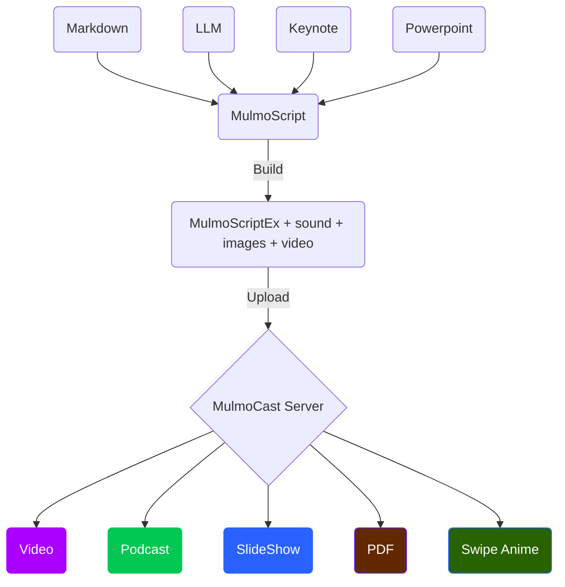

# Workflow

```mermaid
flowchart TD
%% Nodes
    A1("Keynote")
    A2("Markdown")
    A3("LLM")
    A4("Powerpoint")
    B("MulmoScript")
    C("MulmoScriptEx + sound + images + video")
    D{"MulmoCast Server"}
    E("Video")
    G("Podcast")
    I("SlideShow")
    J("PDF")
    K("Swipe Anime")

%% Edge connections between nodes
    A2 --> B
    A3 --> B
    A1 --> B 
    A4 --> B
    B -- Build --> C -- Upload --> D
    D --> E 
    D --> G
    D --> I
    D --> J
    D --> K

%% Individual node styling. Try the visual editor toolbar for easier styling!
    style E color:#FFFFFF, fill:#AA00FF, stroke:#AA00FF
    style G color:#FFFFFF, stroke:#00C853, fill:#00C853
    style I color:#FFFFFF, stroke:#2962FF, fill:#2962FF
    style J color:#FFFFFF, stroke:#6229FF, fill:#622900
    style K color:#FFFFFF, stroke:#2962FF, fill:#296200
```