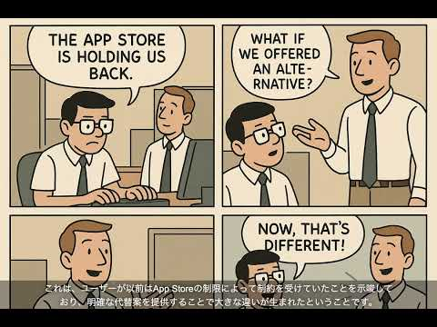

# MulmoCast(マルモキャスト) 0.1.x Beta版 リリースノート

このドキュメントは、ある程度Node.jsとターミナル操作に慣れている開発者・クリエイター向けです。
より使いやすいアプリの開発も進めているので、少々お待ちください。

## ベータ版を使う際に最低限必要なもの

1. macOSが動作するパソコン（※LinuxやWindowsでの動作は未確認）
2. テキストエディターが使えること（Visual Studio Code、Emacs、Vim など）
3. Node.jsおよびHomebrew（brew）が既にインストールされていること
4. ChatGPTのアカウントを持っていること（無料アカウントでも可）
5. OpenAIの開発者向けアカウントを持っていること（従量課金のAPIを使用）

---

## 環境設定

### 必須項目

1. ターミナルで以下を実行して、mulmocast をインストールします：

   ```bash
   npm install -g mulmocast
   ```

2. ffmpeg をインストールします：

   ```bash
   brew install ffmpeg
   ```

3. OpenAIの [APIキー設定ページ](https://platform.openai.com/settings/organization/api-keys) で、`sk-XXXX` 形式のAPIキーを取得します

4. 作業用フォルダーを作成し、その中に `.env` というテキストファイルを作成し、以下の1行を追加します：

   ```
   OPENAI_API_KEY=sk-XXXX
   ```

   ※`sk-XXXX`はあなたのAPIキーに置き換えてください。

### 推奨項目（綺麗な画像生成のために必要）

5. OpenAIの [Settings > Organization > General](https://platform.openai.com/settings/organization/general) ページの「Verification」セクションで個人認証を行います

6. 認証後、`.env`ファイルに以下の1行を追加します：

   ```
   DEFAULT_OPENAI_IMAGE_MODEL=gpt-image-1
   ```

---

## コミックスタイルの動画作成

MulmoCastは、ビジネス向けプレゼンからポッドキャストまで、さまざまな形式の（＝マルチ・モーダルな）コンテンツを作るためのツールです。ここでは、まずコミックスタイルの動画を作る練習をしてみましょう。

[](https://youtu.be/VQVH1w7rY_M)  
*上の画像をクリックすると、生成される動画例(YouTube)が開きます*

### 基本操作

1. 映像化したいWebページのURLをクリップボードにコピーします

2. ChatGPTで新しいチャットを開始し、そのURLを読むように指示します（例："Read this article: https://..."）

3. ターミナルで以下を実行します：

   ```bash
   mulmo tool prompt -t comic_strips
   ```

   ※次項でChatGPTに指示するためのプロンプトが出力され、同時にクリップボードにコピーされます。

4. ChatGPTの画面に戻り、3項のプロンプトを貼り付け、実行します

5. ChatGPTがスクリプトを生成したら、それをコピー（スクリプト右上のコピーボタンを使用）します

6. ターミナルに戻り、以下を実行します：

   ```bash
   mulmo movie __clipboard
   ```

   ※アンダーライン（`__`）は2本です。

   動画の生成が開始されます。（パソコンのスペックにもよりますが数分ほどかかります。）生成された動画は、作業フォルダー内の `output` フォルダーに保存されます。ファイル名は作成された日時に基づき、以下のようになります：

   ```bash
   ./output
   ├── audio
   │   └── script_20250522_155403 //音声生成の過程で生成された音声が格納されるフォルダー 
   ├── images
   │   └── script_20250522_155403 //動画生成の過程で生成された画像が格納されるフォルダー
   ├── script_20250522_155403_studio.json //MulmoScript を元に自動更新されるシステム向けJSONファイル
   ├── script_20250522_155403.json //生成されたMulmoScript（ChatGPT で生成したJSONファイル）
   ├── script_20250522_155403.mp3 //生成された音声
   └── script_20250522_155403.mp4 //生成された動画
   ```
   
   以降の説明では、ここで生成される MulmoScript（実際のファイル名は、作成した日時から決まります（形式：`script_yyyymmdd_hhmmss.json`）。上記の例では、`script_20250522_155403.json`）を指定していきます。

---

## 日本語版の映像の作成

上記の手順で生成されたスクリプトファイル名を元に、ターミナルで以下を実行します(`script_20250522_155403`の部分は、上で作成されたファイル名を指定してください)：

- **日本語字幕付き映像を作成する場合：**

  ```bash
  mulmo movie output/script_20250522_155403.json -c ja
  ```

  → `output`フォルダーに `__ja` というサフィックスが付いた動画が生成されます（アンダーラインは2本）。

- **日本語音声付き映像を作成する場合：**

  ```bash
  mulmo movie script_20250522_155403.json -l ja
  ```

  → `output`フォルダーに `_ja` というサフィックスが付いた動画が生成されます（アンダーラインは1本）。

---

## ジブリ風のコミック映像を作成したい場合

基本操作ステップ3で以下のコマンドを実行すると、ジブリ風映像用のプロンプトが生成されます：

```bash
mulmo tool prompt -t ghibli_strips
```

ただし、OpenAIの画像生成ポリシーにより、ジブリ風画像の生成は「コンテンツポリシーに違反する」として拒否される場合があります。これは、特に著作権保護が疑われるキャラクターに類似していると判断された際に発生します。ご了承ください。

---

## ビジネス・プレゼン映像を作成したい場合

基本操作ステップ3で以下のコマンドを実行すると、ビジネス・プレゼン向けのプロンプトが生成されます：

```bash
mulmo tool prompt -t business
```
