# images

This file is an auto-generated documentation of the GraphAI graph structure defined in:
[https://github.com/receptron/mulmocast-cli/blob/main/src/actions/images.ts](https://github.com/receptron/mulmocast-cli/blob/main/src/actions/images.ts)

## Graph Structure

The following Mermaid diagram shows the GraphAI graph structure defined in this script:

```mermaid
flowchart TD
  n_context(context)
  n_htmlImageAgentInfo(htmlImageAgentInfo)
  n_outputStudioFilePath(outputStudioFilePath)
  n_imageRefs(imageRefs)
  subgraph n_map[map: mapAgent]
    n_map_context(context)
    n_map_htmlImageAgentInfo(htmlImageAgentInfo)
    n_map_imageRefs(imageRefs)
    n_map_beat(beat)
    n_map___mapIndex(__mapIndex)
    n_map_forceMovie(forceMovie)
    n_map_forceImage(forceImage)
    n_map_forceLipSync(forceLipSync)
    n_map_forceSoundEffect(forceSoundEffect)
    n_map_preprocessor(preprocessor<br/>imagePreprocessAgent)
    n_map_context --> n_map_preprocessor
    n_map_beat --> n_map_preprocessor
    n_map___mapIndex --> n_map_preprocessor
    n_map_imageRefs --> n_map_preprocessor
    n_map_imagePlugin(imagePlugin<br/>imagePluginAgent)
    n_map_context --> n_map_imagePlugin
    n_map_beat --> n_map_imagePlugin
    n_map___mapIndex --> n_map_imagePlugin
    n_map_preprocessor --> n_map_imagePlugin
    n_map_htmlImageAgent(htmlImageAgent<br/>:htmlImageAgentInfo.agent)
    n_map_preprocessor -- htmlPrompt --> n_map_htmlImageAgent
    n_map_preprocessor -- htmlImageSystemPrompt --> n_map_htmlImageAgent
    n_map_htmlImageAgentInfo -- model --> n_map_htmlImageAgent
    n_map_htmlImageAgentInfo -- max_tokens --> n_map_htmlImageAgent
    n_map_context -- force --> n_map_htmlImageAgent
    n_map_forceImage --> n_map_htmlImageAgent
    n_map_preprocessor -- htmlPath --> n_map_htmlImageAgent
    n_map___mapIndex --> n_map_htmlImageAgent
    n_map_beat -- id --> n_map_htmlImageAgent
    n_map_context --> n_map_htmlImageAgent
    n_map_htmlReader(htmlReader<br/>agent)
    n_map_htmlImageAgent --> n_map_htmlReader
    n_map_preprocessor -- htmlPath --> n_map_htmlReader
    n_map_htmlImageGenerator(htmlImageGenerator<br/>htmlImageGeneratorAgent)
    n_map_htmlReader -- htmlText --> n_map_htmlImageGenerator
    n_map_context -- presentationStyle.canvasSize --> n_map_htmlImageGenerator
    n_map_preprocessor -- htmlImageFile --> n_map_htmlImageGenerator
    n_map_imageGenerator(imageGenerator<br/>:preprocessor.imageAgentInfo.agent)
    n_map_preprocessor -- prompt --> n_map_imageGenerator
    n_map_preprocessor -- referenceImages --> n_map_imageGenerator
    n_map_context -- force --> n_map_imageGenerator
    n_map_forceImage --> n_map_imageGenerator
    n_map_preprocessor -- imagePath --> n_map_imageGenerator
    n_map___mapIndex --> n_map_imageGenerator
    n_map_beat -- id --> n_map_imageGenerator
    n_map_context --> n_map_imageGenerator
    n_map_preprocessor -- imageParams.model --> n_map_imageGenerator
    n_map_preprocessor -- imageParams.moderation --> n_map_imageGenerator
    n_map_context -- presentationStyle.canvasSize --> n_map_imageGenerator
    n_map_preprocessor -- imageParams.quality --> n_map_imageGenerator
    n_map_movieGenerator(movieGenerator<br/>:preprocessor.movieAgentInfo.agent)
    n_map_imageGenerator --> n_map_movieGenerator
    n_map_imagePlugin --> n_map_movieGenerator
    n_map_beat -- moviePrompt --> n_map_movieGenerator
    n_map_preprocessor -- referenceImageForMovie --> n_map_movieGenerator
    n_map_preprocessor -- movieFile --> n_map_movieGenerator
    n_map_context -- force --> n_map_movieGenerator
    n_map_forceMovie --> n_map_movieGenerator
    n_map_preprocessor -- movieFile --> n_map_movieGenerator
    n_map___mapIndex --> n_map_movieGenerator
    n_map_beat -- id --> n_map_movieGenerator
    n_map_context --> n_map_movieGenerator
    n_map_preprocessor -- movieAgentInfo.movieParams.model --> n_map_movieGenerator
    n_map_preprocessor -- beatDuration --> n_map_movieGenerator
    n_map_context -- presentationStyle.canvasSize --> n_map_movieGenerator
    n_map_imageFromMovie(imageFromMovie<br/>agent)
    n_map_movieGenerator --> n_map_imageFromMovie
    n_map_preprocessor -- imagePath --> n_map_imageFromMovie
    n_map_preprocessor -- movieFile --> n_map_imageFromMovie
    n_map_audioChecker(audioChecker<br/>agent)
    n_map_movieGenerator --> n_map_audioChecker
    n_map_htmlImageGenerator --> n_map_audioChecker
    n_map_soundEffectGenerator --> n_map_audioChecker
    n_map_preprocessor -- movieFile --> n_map_audioChecker
    n_map_preprocessor -- imagePath --> n_map_audioChecker
    n_map_preprocessor -- soundEffectFile --> n_map_audioChecker
    n_map_soundEffectGenerator(soundEffectGenerator<br/>:preprocessor.soundEffectAgentInfo.agentName)
    n_map_movieGenerator --> n_map_soundEffectGenerator
    n_map_preprocessor -- soundEffectPrompt --> n_map_soundEffectGenerator
    n_map_preprocessor -- movieFile --> n_map_soundEffectGenerator
    n_map_preprocessor -- soundEffectFile --> n_map_soundEffectGenerator
    n_map_preprocessor -- soundEffectModel --> n_map_soundEffectGenerator
    n_map_preprocessor -- beatDuration --> n_map_soundEffectGenerator
    n_map_context -- force --> n_map_soundEffectGenerator
    n_map_forceSoundEffect --> n_map_soundEffectGenerator
    n_map_preprocessor -- soundEffectFile --> n_map_soundEffectGenerator
    n_map___mapIndex --> n_map_soundEffectGenerator
    n_map_beat -- id --> n_map_soundEffectGenerator
    n_map_context --> n_map_soundEffectGenerator
    n_map_AudioTrimmer(AudioTrimmer<br/>agent)
    n_map_imageGenerator --> n_map_AudioTrimmer
    n_map_imagePlugin --> n_map_AudioTrimmer
    n_map_preprocessor -- audioFile --> n_map_AudioTrimmer
    n_map_preprocessor -- bgmFile --> n_map_AudioTrimmer
    n_map_preprocessor -- startAt --> n_map_AudioTrimmer
    n_map_preprocessor -- duration --> n_map_AudioTrimmer
    n_map_context -- force --> n_map_AudioTrimmer
    n_map_preprocessor -- audioFile --> n_map_AudioTrimmer
    n_map___mapIndex --> n_map_AudioTrimmer
    n_map_beat -- id --> n_map_AudioTrimmer
    n_map_context --> n_map_AudioTrimmer
    n_map_lipSyncGenerator(lipSyncGenerator<br/>:preprocessor.lipSyncAgentName)
    n_map_soundEffectGenerator --> n_map_lipSyncGenerator
    n_map_AudioTrimmer --> n_map_lipSyncGenerator
    n_map_preprocessor -- movieFile --> n_map_lipSyncGenerator
    n_map_preprocessor -- referenceImageForMovie --> n_map_lipSyncGenerator
    n_map_preprocessor -- audioFile --> n_map_lipSyncGenerator
    n_map_preprocessor -- lipSyncFile --> n_map_lipSyncGenerator
    n_map_preprocessor -- lipSyncModel --> n_map_lipSyncGenerator
    n_map_preprocessor -- beatDuration --> n_map_lipSyncGenerator
    n_map_context -- force --> n_map_lipSyncGenerator
    n_map_forceLipSync --> n_map_lipSyncGenerator
    n_map_preprocessor -- lipSyncFile --> n_map_lipSyncGenerator
    n_map___mapIndex --> n_map_lipSyncGenerator
    n_map_beat -- id --> n_map_lipSyncGenerator
    n_map_context --> n_map_lipSyncGenerator
    n_map_output(output<br/>copyAgent)
    n_map_imageFromMovie --> n_map_output
    n_map_htmlImageGenerator --> n_map_output
    n_map_audioChecker --> n_map_output
    n_map_soundEffectGenerator --> n_map_output
    n_map_lipSyncGenerator --> n_map_output
    n_map_preprocessor -- imagePath --> n_map_output
    n_map_preprocessor -- movieFile --> n_map_output
    n_map_preprocessor -- soundEffectFile --> n_map_output
    n_map_preprocessor -- lipSyncFile --> n_map_output
    n_map_audioChecker -- hasMovieAudio --> n_map_output
    n_map_preprocessor -- htmlImageFile --> n_map_output
  end
  n_context -- studio.script.beats --> n_map
  n_context --> n_map
  n_htmlImageAgentInfo --> n_map
  n_imageRefs --> n_map
  n_mergeResult(mergeResult<br/>agent)
  n_map -- output --> n_mergeResult
  n_context --> n_mergeResult
  n_writeOutput(writeOutput<br/>fileWriteAgent)
  n_outputStudioFilePath --> n_writeOutput
  n_mergeResult -- studio.toJSON() --> n_writeOutput
  class n_context,n_htmlImageAgentInfo,n_outputStudioFilePath,n_imageRefs,n_map_context,n_map_htmlImageAgentInfo,n_map_imageRefs,n_map_beat,n_map___mapIndex,n_map_forceMovie,n_map_forceImage,n_map_forceLipSync,n_map_forceSoundEffect staticNode
  class n_map_preprocessor,n_map_imagePlugin,n_map_htmlImageAgent,n_map_htmlReader,n_map_htmlImageGenerator,n_map_imageGenerator,n_map_movieGenerator,n_map_imageFromMovie,n_map_audioChecker,n_map_soundEffectGenerator,n_map_AudioTrimmer,n_map_lipSyncGenerator,n_map_output,n_mergeResult,n_writeOutput computedNode
  class n_map nestedGraph
```

---

*This document is auto-generated. Please do not edit manually.*
